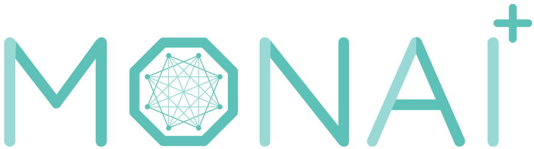

# Welcome to the MONAI Deploy Bootcamp

MONAI Deploy aims to become the de-facto standard for developing packaging, testing, deploying, and running medical AI applications in clinical production. 

With MONAI Deploy, researchers and clinicians can build confidence in their AI techniques and approaches, thanks to a set of intermediate steps that allow for an iterative workflow. This means that you can refine your AI inference infrastructure until it's ready to be deployed in clinical environments.

In this notebook, you'll learn about the MONAI Deploy App SDK and the MONAI Application Package (MAP).

## Table of Contents
- What is MONAI?
- Lab Content

## What is MONAI?

MONAI is the open-source, domain-specific Medical AI framework that accelerates research breakthroughs and drives AI into clinical impact. MONAI makes it easy to develop, reproduce, and standardize medical AI lifecycles, providing essential domain-specific tools from data labeling to model training. With MONAI, you can unlock the power of medical data to build deep learning models for medical AI workflows.

Learn more about MONAI by visiting the [MONAI website](https://monai.io/).

## Lab Content
In this lab, you'll learn about the MONAI Deploy App SDK. You'll start by learning about the building blocks of a MONAI Application called Operators and how they are composed using a Directed Acyclical Graph (DAG).

You'll also learn about some of the pre-defined operators within the MONAI Deploy App SDK, which help streamline the application creation process by handling DICOM I/O steps. This allows you to focus on integrating your AI model.

You'll walk through the process of creating a Spleen Segmentation App and bundling it into a MAP. You'll then implement the flow with another provided model, gaining hands-on experience that will show you how to integrate your own custom model after the bootcamp is finished.